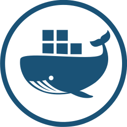

# Cloud Docker
By [cre.ativo mustard](https://thenounproject.com/cre.ativo.mustard), from the [Noun Project](https://thenounproject.com/term/docker/676618/)

The project icon is pulled from 'TheNounProject', and adapted into the flat-circle icon approach.

The icon has been altered for the purposes of a project icon.

---
|||
|---|---|
|**Title**|Cloud Docker|
|**Author**|[cre.ativo mustard](https://thenounproject.com/cre.ativo.mustard)|
|**Source**|https://thenounproject.com/term/docker/676618/|
|**License**|Creative Commons By 3.0|
|**Tags**|Cloud Docker, Cloud, Container, Data, Docker, Host|

---